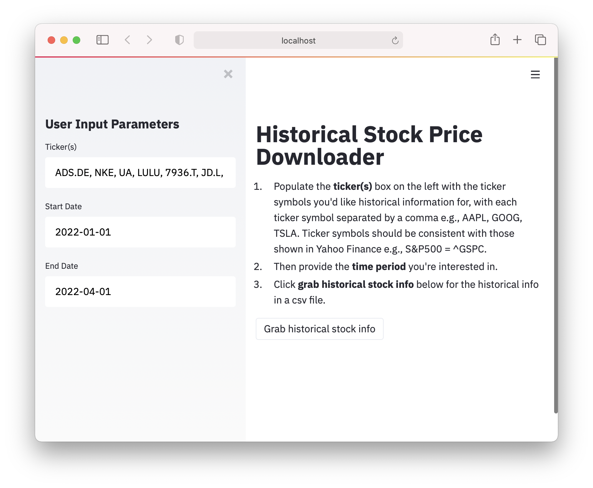

# MarketPulse Streamlit Project

<p align="center">
  
</p>

👉🏽 **[You can access the streamlit app here](https://jrodriguez5909-marketpulse-streamlit-marketpulse-l8r1k5.streamlitapp.com/)**

This package scrapes stock price data from Yahoo! Finance through the `yfinance` Python library. The user can grab historical stock prices through the Streamlit frontend by specifying the ticker symbols _(symbols must be consistent with how they're shown in Yahoo! Finance)_ and the desired timeframe. 

## Running this app on your local host

Run the following command in your CLI (command line interface), most conveniently in the terminal of your IDE (PyCharm, VS Code) while having your project open. This helps for making edits to the script and visualizing those edits quickly:

```$ streamlit run MarketPulse.py```
